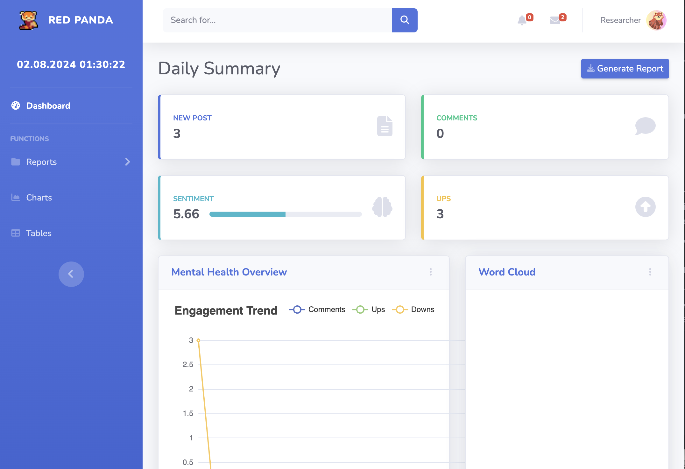

# Red Panda

Web app for data collection, prediction, emotion analysis, and topic analysis on Reddit with interactive visualizations.

The aim of Red Panda is to:

- Integrate machine learning models, including the SuiBERT prediction model, BERTopic topic clustering model, as well as emotion and engagement measurement models, to summarize evolving multi-modal data (involving images, videos, or other sensor data) in mental health-related subreddits.
    
- Create and deploy a web-based visual analytics tool that can display the summarized insights to stakeholders and enable them to provide different forms of feedback interactively.
    
- Conduct research and experiments to investigate human-in-the-loop AI techniques to improve the summarization model using reinforcement learning from human feedback (RLHF).
    
- Generate daily logs to document the dynamic patterns and capture more fine-grained details for customised digital mental health interventions.

